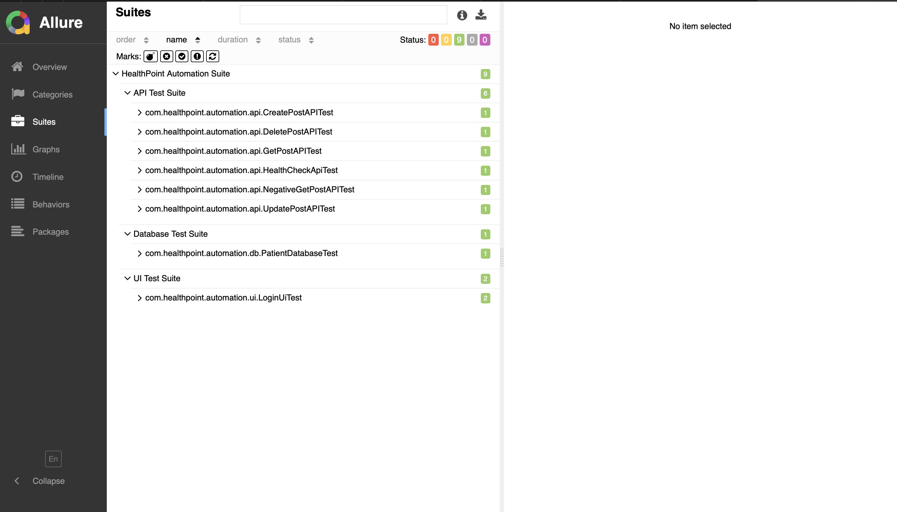
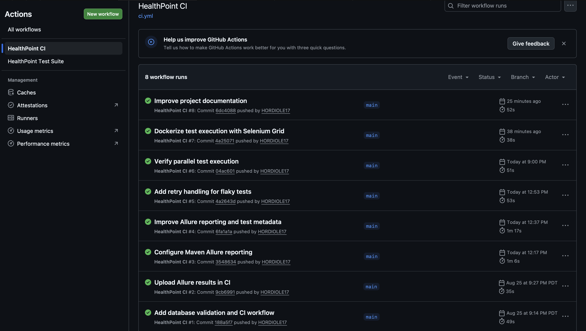
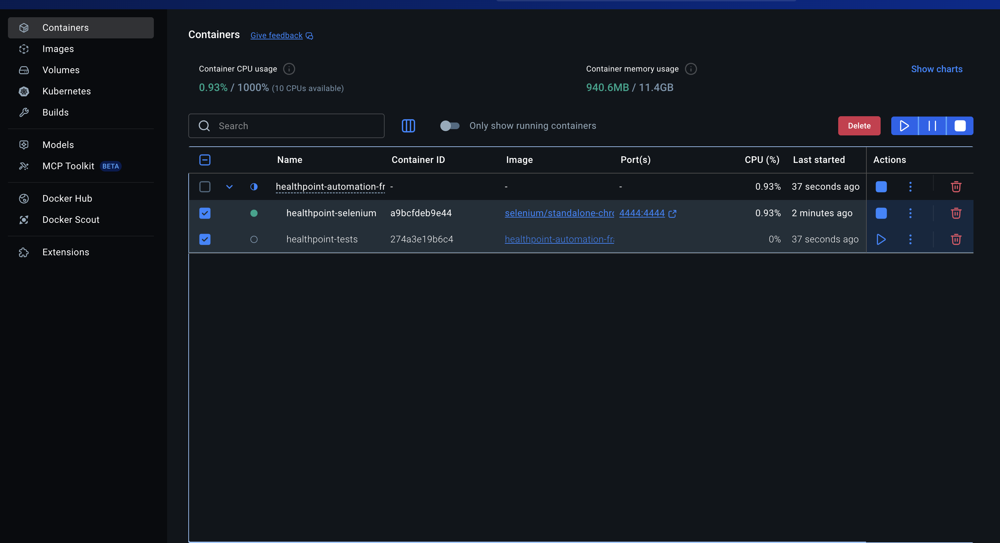
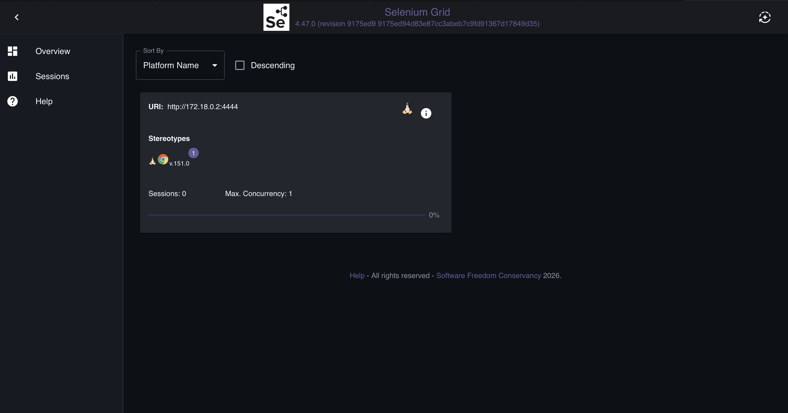

# HealthPoint Automation Framework

[](https://github.com/Hordyoleh17/Healthpoint-automation-framework/actions/workflows/ci.yml)

Java-based test automation framework for API, UI, and database validation with parallel execution, automated reporting, CI/CD, and containerized browser execution.

The framework is designed around reusable components and separation of concerns, allowing tests to run locally, in GitHub Actions, or through Docker with Selenium Grid.

## Tech Stack

- Java 17
- Selenium WebDriver
- REST Assured
- TestNG
- Maven
- H2 Database
- Allure Report
- GitHub Actions
- Docker & Docker Compose
- Selenium Grid / RemoteWebDriver
- WebDriverManager
- AssertJ
- Jackson

## Current Test Suite

```text
Tests run: 9
Failures: 0
Errors: 0
Skipped: 0
```

The suite covers three automation layers:

### API Testing

- API health check
- GET request validation
- Negative GET / 404 validation
- POST / create validation
- PUT / update validation
- DELETE validation
- Status code assertions
- Response body validation

### UI Testing

- Selenium WebDriver automation
- Login flow validation
- Inventory page validation
- Page Object Model
- Thread-safe WebDriver lifecycle

### Database Testing

- H2 database setup
- SQL query execution
- Test data seeding
- Patient record validation
- Field-level assertions

## Architecture

```text
                         TestNG
                            |
             +--------------+--------------+
             |              |              |
             v              v              v
         API Tests       UI Tests       DB Tests
             |              |              |
             v              v              v
        PostClient      Page Objects   DatabaseUtils
             |              |              |
             v              v              v
       REST Assured     DriverFactory      H2
                            |
                  +---------+---------+
                  |                   |
                  v                   v
             ChromeDriver       RemoteWebDriver
                                      |
                                      v
                              Selenium Grid
                                      |
                                      v
                              Docker Chrome
```

## Project Structure

```text
Healthpoint-automation-framework
|
|-- .github/
|   `-- workflows/
|       `-- ci.yml
|
|-- src/
|   |-- main/
|   |   |-- java/com/healthpoint/automation/
|   |   |   |-- clients/
|   |   |   |-- config/
|   |   |   |-- driver/
|   |   |   |-- models/
|   |   |   |-- pages/
|   |   |   `-- utils/
|   |   `-- resources/
|   |
|   `-- test/
|       |-- java/com/healthpoint/automation/
|       |   |-- api/
|       |   |-- base/
|       |   |-- db/
|       |   |-- listeners/
|       |   |-- retry/
|       |   |-- ui/
|       |   `-- utils/
|       `-- resources/
|
|-- Dockerfile
|-- docker-compose.yml
|-- pom.xml
|-- testng.xml
`-- README.md
```

## Framework Design

The framework separates test scenarios from implementation details.

For API testing:

```text
Test -> PostClient -> REST Assured -> API
```

For UI testing:

```text
Test -> Page Object -> DriverFactory -> WebDriver
```

For database testing:

```text
Test -> DatabaseUtils -> SQL -> H2
```

This keeps request handling, browser management, database access, and test assertions in separate layers.

## Parallel Execution

TestNG runs test methods in parallel:

```xml
<suite name="HealthPoint Automation Suite"
       parallel="methods"
       thread-count="2">
```

WebDriver instances are managed using:

```java
ThreadLocal<WebDriver>
```

This prevents parallel UI tests from sharing the same browser instance.

Parallel execution has been verified through thread-level logging during test runs.

## Retry Handling

The framework includes automatic retry handling for transient failures using TestNG:

- `RetryAnalyzer`
- `RetryTransformer`

Retries are intentionally limited to one additional attempt to avoid masking genuine failures.

## Allure Reporting

Allure reporting is integrated with Maven and TestNG.

Generate a report:

```bash
mvn allure:report
```

Reports include:

- Features
- Stories
- Severity
- Test descriptions
- Execution results
- Environment metadata

Environment information includes Java, Maven, TestNG, Selenium, REST Assured, H2, Chrome, and CI execution details.

## CI/CD

GitHub Actions automatically executes the test suite on pushes and pull requests to `main`.

```text
Git Push / Pull Request
          |
          v
    GitHub Actions
          |
          v
      Java 17
          |
          v
    mvn clean test
          |
          v
     Allure Report
          |
          v
   CI Artifacts
```

The pipeline publishes:

- Allure raw results
- Allure HTML report

## Docker Execution

The framework supports fully containerized execution with Docker Compose.

```text
+---------------------------+
| healthpoint-tests         |
| Java 17 + Maven           |
| Automation Framework      |
+-------------+-------------+
              |
              | RemoteWebDriver
              v
+---------------------------+
| healthpoint-selenium      |
| Selenium Standalone       |
| Chrome                    |
+---------------------------+
```

The test container communicates with Selenium through the Docker network:

```text
http://selenium-chrome:4444
```

This separates the automation runtime from the browser runtime and provides a reproducible execution environment.

## Running Locally

Requirements:

- Java 17+
- Maven
- Google Chrome

Run all tests:

```bash
mvn clean test
```

Expected result:

```text
Tests run: 9, Failures: 0, Errors: 0, Skipped: 0
BUILD SUCCESS
```

## Running with Docker

Requirements:

- Docker
- Docker Compose

Build and execute the complete environment:

```bash
docker compose up --build
```

Expected result:

```text
Tests run: 9, Failures: 0, Errors: 0, Skipped: 0
BUILD SUCCESS
```

Stop the environment:

```bash
docker compose down
```

## Configuration

Runtime configuration is stored in:

```text
src/main/resources/config.properties
```

Example:

```properties
base.url=https://jsonplaceholder.typicode.com
```

Credentials, tokens, and other secrets should not be committed to the repository.

## Key Engineering Features

- Multi-layer API, UI, and database automation
- Reusable API client architecture
- Page Object Model
- Thread-safe WebDriver management
- Parallel TestNG execution
- Automatic retry handling
- Allure reporting
- Environment metadata
- GitHub Actions CI/CD
- Dockerized test execution
- RemoteWebDriver
- Selenium Grid
- Local and containerized execution

## Future Improvements

- Cross-browser execution
- Parameterized environments
- Expanded negative API coverage
- Additional UI scenarios
- External test data management
- Selenium Grid browser matrix
- Cloud-based test execution


## Execution Evidence

### Allure Test Results

The current suite includes API, UI, and database validation with all tests passing.



### GitHub Actions CI

The repository uses GitHub Actions to run automated tests and generate Allure artifacts on every push and pull request to `main`.



### Dockerized Execution

The test framework runs in a dedicated Maven container and connects to a separate Selenium Chrome container through Docker Compose.



### Selenium Grid

UI tests execute through `RemoteWebDriver` against the Selenium Chrome container.




## Execution Evidence

### Allure Test Results

The current suite includes API, UI, and database validation with all tests passing.


### GitHub Actions CI

The repository uses GitHub Actions to run automated tests and generate Allure artifacts on every push and pull request to `main`.


### Dockerized Execution

The test framework runs in a dedicated Maven container and connects to a separate Selenium Chrome container through Docker Compose.


### Selenium Grid

UI tests execute through `RemoteWebDriver` against the Selenium Chrome container.


